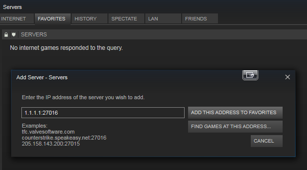

.. Ark Dedicated Server Setup + All DLC documentation master file, created by
   sphinx-quickstart on Fri Dec 13 06:15:33 2019.
   You can adapt this file completely to your liking, but it should at least
   contain the root `toctree` directive.

Ark Dedicated Server Setup + All DLCs (2019):
================================================================

.. toctree::
   :maxdepth: 2
   :caption: Contents:

Introduction
==================

This is a doc on how to build an Ark Survival Evolved Server, with all DLCs installed using a shared cluster method for allowing Items, Dinos and players to transfer between world maps. I've tested this guide out multiple times and have my own running servers for Ark using the steps I've provided here.

Steps involved
==================

.. caution::

 This guide requires a basic understanding of Linux System Administration. Their are several concepts with regards to Linux that are being applied here including the creation of SystemD Units and modifying of Linux File Heirarchy for Ubuntu 18.04. These concepts I won't be going into much descussion here and it is assumed that you are aware of these concepts when you proceed with this guide. Please work with caution.

This guide will be following the guide found at https://survivetheark.com/index.php?/forums/topic/87419-guide-cluster-setup/ and information provided from https://survivetheark.com/index.php?/forums/topic/85463-scorched-earth-technicaldetail-faq-ongoing/ respectfully. 

For this build I used ``Ubuntu 18.04 LTS`` as my OS. This setup is a mixture of the ``Method 1`` used in the above setup with my own spin on it for use with modern Ubuntu 18.04, since 14.04 LTS (as referenced in the official Ark Documentation) has since been depreciated.

I've created an Ark Dedicated server with a shared Cluster ID using individual save file locations for each map. Uploaded items to the Obelisks will go to the Cluster save directory to be shared amoungst the maps. This includes the base game along with The Center, Scorched Earth, Ragnarok, Abberation, Extinction and Valguero maps. 

At the time of this writing the version of Ark was ``v303.1``, before the Genesis Expansion release. It is currently unknown whether you can transfer Items and Dinos from The Island map back to Scorched Earth though. Will test this out in future.

Lets get started.

^^^^^^^^^^^^^^^^^^^^^^^^^
Step 1: Launch Ubuntu
^^^^^^^^^^^^^^^^^^^^^^^^^

Launch a running Ubuntu 18.04 LTS Server. This can be a baremetal, virtual machine or a container respectfully. For this guide I used AWS's EC2 virtual instance.

^^^^^^^^^^^^^^^^^^^^^^^^
Step 2: Update OS
^^^^^^^^^^^^^^^^^^^^^^^^

Once your instance/OS is launched, log into it and perform a full update and upgrade with the following command. Please note you will need to use elevated privilages to execute this::

 sudo apt update -y && sudo apt full-upgrade -y

^^^^^^^^^^^^^^^^^^^^^^^^^^^^^^^^^^^^^^^^^
Step 3: Install EFS Utilities Package
^^^^^^^^^^^^^^^^^^^^^^^^^^^^^^^^^^^^^^^^^

 sudo apt-get -y install git binutils

 git clone https://github.com/aws/efs-utils

 cd efs-utils

 ./build-deb.sh

 sudo apt-get -y install ./build/amazon-efs-utils*deb

^^^^^^^^^^^^^^^^^^^^^^^^^^^^^^^^^^^^^^^^^
Step 4: Add EFS drive to /etc/fstab
^^^^^^^^^^^^^^^^^^^^^^^^^^^^^^^^^^^^^^^^^

 sudo vim /etc/fstab

 file_system_id.efs.aws-region.amazonaws.com:/ /home/ubuntu/ArkServers nfs4 nfsvers=4.1,rsize=1048576,wsize=1048576,hard,timeo=600,retrans=2,noresvport,_netdev 0 0

^^^^^^^^^^^^^^^^^^^^^^^^
Step 5: Reboot Server
^^^^^^^^^^^^^^^^^^^^^^^^

Reboot your OS to apply updates to the kernel if their are any::

 sudo reboot

^^^^^^^^^^^^^^^^^^^^^^^^^^^^^^^^^^
Step 6: Remove Old Packages
^^^^^^^^^^^^^^^^^^^^^^^^^^^^^^^^^^

Log back in and remove any unnecessary packages::

 sudo apt autoremove -y

^^^^^^^^^^^^^^^^^^^^^^^^^^^^^^^^^^^^^^^^^
Step 7: Install Required Libraries
^^^^^^^^^^^^^^^^^^^^^^^^^^^^^^^^^^^^^^^^^

Install the latest packages that contain the lib32gccl package. This is necessary for installing the SteamCMD. For Ubuntu 18.04 this package is found in the libc6 package at the time of this writing::

 sudo apt install -y libc6 libc6-dev

^^^^^^^^^^^^^^^^^^^^^^^^^^^^^^^^^^
Step 8: Set Max File Limit
^^^^^^^^^^^^^^^^^^^^^^^^^^^^^^^^^^

To ensure that the server's open files limit is high enough you will need to edit the ``/etc/sysctl.conf`` file::

 sudo vim /etc/sysctl.conf

Add the following line and save the file:

.. line-block::

`fs.file-max=100000`

^^^^^^^^^^^^^^^^^^^^^^^^^^^^^^^^^^^^^
Step 9: Set OS Corefiles Limit
^^^^^^^^^^^^^^^^^^^^^^^^^^^^^^^^^^^^^

Add the following lines to ``/etc/security/limits.conf``:

.. line-block::

 `*             soft    nofile          1000000`
 `*             hard    nofile          1000000`

^^^^^^^^^^^^^^^^^^^^^^^^^^^^^^^^^^^^^
Step 10: Enable PAM Limits
^^^^^^^^^^^^^^^^^^^^^^^^^^^^^^^^^^^^^

Add the following to the ``/etc/pam.d/common-session`` file:

`session required pam_limits.so`

^^^^^^^^^^^^^^^^^^^^^^^^^^^^^^^^^^^^^
Step 11: Install SteamCMD
^^^^^^^^^^^^^^^^^^^^^^^^^^^^^^^^^^^^^

Add the repository that contains the SteamCMD and install the it::

 sudo add-apt-repository multiverse
 sudo dpkg --add-architecture i386
 sudo apt update -y
 sudo apt install lib32gcc-s1 steamcmd -y

^^^^^^^^^^^^^^^^^^^^^^^^^^^^^^^^^^^^^^^^^^^^^^^^^
Step 12: Create Ark Server Main Directory
^^^^^^^^^^^^^^^^^^^^^^^^^^^^^^^^^^^^^^^^^^^^^^^^^

Make a directory for your Ark servers::

 mkdir ArkServers

^^^^^^^^^^^^^^^^^^^^^^^^^^^^^^^^^^^^^^^^^^^^^^^^^
Step 13: Install Ark Server via Steam
^^^^^^^^^^^^^^^^^^^^^^^^^^^^^^^^^^^^^^^^^^^^^^^^^

Log into Steam as an anonymous user using the SteamCMD and download the latest Ark Server files:

.. code::

 steamcmd +force_install_dir /home/ubuntu/ArkServers +login anonymous +app_update 376030 +quit

^^^^^^^^^^^^^^^^^^^^^^^^^^^^^^^^^^^^^^^^^^^^^^^^^^^^^^^^
Step 14: Setup Game User Settings for Ark Server
^^^^^^^^^^^^^^^^^^^^^^^^^^^^^^^^^^^^^^^^^^^^^^^^^^^^^^^^

Create the file ``/home/ubuntu/ArkServers/ShooterGame/Saved/Config/LinuxServer/GameUserSettings.ini`` and paste the following content in it. Please see GameUserSettings.ini in https://ark.gamepedia.com/Server_Configuration for more detailed info on the configuration option meanings.

.. code::

 [/Script/ShooterGame.ShooterGameUserSettings]
 MasterAudioVolume=1.000000
 MusicAudioVolume=1.000000
 SFXAudioVolume=1.000000
 VoiceAudioVolume=1.000000
 UIScaling=1.000000
 UIQuickbarScaling=0.650000
 CameraShakeScale=0.650000
 bFirstPersonRiding=True
 bThirdPersonPlayer=True
 bShowStatusNotificationMessages=True
 TrueSkyQuality=0.000000
 FOVMultiplier=1.000000
 GroundClutterDensity=0.000000
 bFilmGrain=False
 bMotionBlur=False
 bUseDistanceFieldAmbientOcclusion=False
 bUseSSAO=False
 bShowChatBox=True
 bCameraViewBob=True
 bInvertLookY=False
 bFloatingNames=True
 bChatBubbles=True
 bHideServerInfo=False
 bJoinNotifications=True
 bCraftablesShowAllItems=False
 bLocalInventoryItemsShowAllItems=False
 bLocalInventoryCraftingShowAllItems=True
 bRemoteInventoryItemsShowAllItems=False
 bRemoteInventoryCraftingShowAllItems=False
 bRemoteInventoryShowEngrams=True
 LookLeftRightSensitivity=1.000000
 LookUpDownSensitivity=1.000000
 GraphicsQuality=1
 ActiveLingeringWorldTiles=1
 ClientNetQuality=3
 LastServerSearchType=0
 LastServerSort=2
 LastPVESearchType=-1
 LastDLCTypeSearchType=-1
 LastServerSortAsc=True
 LastAutoFavorite=True
 LastServerSearchHideFull=False
 LastServerSearchProtected=False
 HideItemTextOverlay=True
 bQuickToggleItemNames=True
 bDistanceFieldShadowing=False
 LODScalar=0.780000
 bToggleToTalk=False
 HighQualityMaterials=True
 HighQualitySurfaces=True
 bTemperatureF=False
 bDisableTorporEffect=False
 bChatShowSteamName=False
 bChatShowTribeName=True
 bReverseTribeLogOrder=False
 EmoteKeyBind1=0
 EmoteKeyBind2=0
 bNoBloodEffects=False
 bLowQualityVFX=False
 bSpectatorManualFloatingNames=False
 bSuppressAdminIcon=False
 bUseSimpleDistanceMovement=False
 bDisableMeleeCameraSwingAnims=False
 bHighQualityAnisotropicFiltering=False
 bUseLowQualityLevelStreaming=True
 bPreventInventoryOpeningSounds=False
 bPreventItemCraftingSounds=False
 bPreventHitMarkers=False
 bPreventCrosshair=False
 bPreventColorizedItemNames=False
 bHighQualityLODs=True
 bExtraLevelStreamingDistance=False
 bEnableColorGrading=True
 DOFSettingInterpTime=0.000000
 bDisableBloom=False
 bDisableLightShafts=False
 LastJoinedSessionPerCategory=" "
 LastJoinedSessionPerCategory=" "
 LastJoinedSessionPerCategory=" "
 LastJoinedSessionPerCategory=" "
 LastJoinedSessionPerCategory=" "
 LastJoinedSessionPerCategory=" "
 LastJoinedSessionPerCategory=" "
 LastJoinedSessionPerCategory=" "
 LastJoinedSessionPerCategory=" "
 bDisableMenuTransitions=False
 bEnableInventoryItemTooltips=True
 bRemoteInventoryShowCraftables=False
 bNoTooltipDelay=False
 LocalItemSortType=0
 LocalCraftingSortType=0
 RemoteItemSortType=0
 RemoteCraftingSortType=0
 VersionMetaTag=1
 ShowExplorerNoteSubtitles=False
 DisableMenuMusic=False
 DisableDefaultCharacterItems=False
 bHideFloatingPlayerNames=False
 bHideGamepadItemSelectionModifier=False
 bToggleExtendedHUDInfo=False
 PlayActionWheelClickSound=True
 MaxAscensionLevel=0
 bHostSessionHasBeenOpened=False
 bForceTPVCameraOffset=False
 bDisableTPVCameraInterpolation=False
 bFPVClimbingGear=False
 bFPVGlidingGear=False
 Gamma1=2.200000
 Gamma2=3.000000
 AmbientSoundVolume=1.000000
 bAllowAnimationStaggering=True
 bLowQualityAnimations=True
 bUseVSync=False
 MacroCtrl0=
 MacroCtrl1=
 MacroCtrl2=
 MacroCtrl3=
 MacroCtrl4=
 MacroCtrl5=
 MacroCtrl6=
 MacroCtrl7=
 MacroCtrl8=
 MacroCtrl9=
 ResolutionSizeX=1280
 ResolutionSizeY=720
 LastUserConfirmedResolutionSizeX=1280
 LastUserConfirmedResolutionSizeY=720
 WindowPosX=-1
 WindowPosY=-1
 bUseDesktopResolutionForFullscreen=False
 FullscreenMode=2
 LastConfirmedFullscreenMode=2
 Version=5
 
 [ServerSettings]
 ShowMapPlayerLocation=0
 ForceFlyerExplosives=1
 PreventOfflinePvP=1
 AllowThirdPersonPlayer=True
 PreventDownloadSurvivors=False
 PreventDownloadItems=False
 PreventDownloadDinos=False
 PreventUploadSurvivors=False
 PreventUploadItems=False
 PreventUploadDinos=False
 ShowFloatingDamageText=False
 ServerCrosshair=True
 alwaysNotifyPlayerJoined=1
 alwaysNotifyPlayerLeft=1
 RCONPort=27020
 ServerPassword=password
 ServerAdminPassword=password
 AllowCaveBuildingPvE=1
 BanListURL="http://arkdedicated.com/banlist.txt"
 TheMaxStructuresInRange=10500.000000
 OxygenSwimSpeedStatMultiplier=1.000000
 StructurePreventResourceRadiusMultiplier=1.000000
 TribeNameChangeCooldown=15.000000
 PlatformSaddleBuildAreaBoundsMultiplier=1.000000
 StructurePickupTimeAfterPlacement=30.000000
 StructurePickupHoldDuration=0.500000
 AllowIntegratedSPlusStructures=True
 AllowHideDamageSourceFromLogs=0
 AlwaysAllowStructurePickup=1
 RaidDinoCharacterFoodDrainMultiplier=1.000000
 PvEDinoDecayPeriodMultiplier=1.000000
 KickIdlePlayersPeriod=3600.000000
 PerPlatformMaxStructuresMultiplier=1.000000
 AutoSavePeriodMinutes=15.000000
 ListenServerTetherDistanceMultiplier=1.000000
 MaxTamedDinos=5000.000000
 ItemStackSizeMultiplier=1.000000
 bDisableStructureDecayPvE=1
 DisableDinoDecayPvE=1
 AllowFlyerCarryPvE=1
 RCONServerGameLogBuffer=600.000000
 AllowRaidDinoFeeding=False
 AllowHitMarkers=True
 bUseCorpseLocator=1
 CrossARKAllowForeignDinoDownloads=1
 RandomSupplyCratePoints=0
 
 [ScalabilityGroups]
 sg.ResolutionQuality=100
 sg.ViewDistanceQuality=3
 sg.AntiAliasingQuality=3
 sg.ShadowQuality=3
 sg.PostProcessQuality=3
 sg.TextureQuality=3
 sg.EffectsQuality=3
 sg.TrueSkyQuality=3
 sg.GroundClutterQuality=3
 sg.IBLQuality=1
 sg.HeightFieldShadowQuality=3
 sg.GroundClutterRadius=10000
 
 [SessionSettings]
 SessionName=Eagles_Ragnarok
 
 [/Script/Engine.GameSession]
 MaxPlayers=70
 
 [Ragnarok]
 AllowMultipleTamedUnicorns=1
 UnicornSpawnInterval=12
 EnableVolcano=1

^^^^^^^^^^^^^^^^^^^^^^^^^^^^^^^^^^^^^^^^^
Step 15: Set Ports for Ark Server
^^^^^^^^^^^^^^^^^^^^^^^^^^^^^^^^^^^^^^^^^

Allow your Server's firewall to listen for these incoming traffic ports:

.. line-block::

 `Inbound:`
  * Ports ``27015 - 27020`` ``UDP`` #Ports for client to find Ark Servers.
  * Ports ``37015 - 37022`` ``UDP`` #Ports for client to find the rest of the Ark Servers.
  * Ports ``27020 - 27050`` ``TCP`` and ``UDP`` #Steam Mainframe connections to validate server. These must not overlap with the server finding ports.
  * Ports ``7777 - 7790`` ``UDP`` #The ports that Ark Client connects to server with.
  * Port ``22`` ``TCP`` #Used to SSH into the server if need be.

.. important::

 Every second port is actually what is used for the connections to the Ark Server from the client side. So remember to keep those ports open when you are creating your servers.

 For example `Server1` of ``The Island`` is on port ``7777``. The actual main streaming to the client will be done on port ``7778``. So port ``7777 + 1`` for ``UDP``. You will then have to say host your ``Ragnarok`` server on port ``7779`` and ``Scorched Earth`` on port ``7781``, etc.

.. note::

 Also allow outbound ephemeral ports for the server to be able to connect to Steam Main Frames.

^^^^^^^^^^^^^^^^^^^^^^^^^^^^^^^^^^^^^^^^
Step 16: Set Directory Ownership
^^^^^^^^^^^^^^^^^^^^^^^^^^^^^^^^^^^^^^^^

Recursively set the ownership of the directory that you installed your Ark Servers::

 sudo chown -R ubuntu. /home/ubuntu/ArkServers

.. warning::

 Make sure you use the same user that you used to download the Ark Server with. If you set the wrong ownership to the wrong user or wrong path you could end up breaking your Ark Server and even your whole Ubuntu OS. PLEASE BE CAREFUL and make 100% sure you are in the correct directory and using the correct user.

^^^^^^^^^^^^^^^^^^^^^^^^^^^^^^^^^^^^^^^^^^^
Step 16: Create SystemD Unit Files
^^^^^^^^^^^^^^^^^^^^^^^^^^^^^^^^^^^^^^^^^^^

Because Ubuntu 18.04 uses SystemD, I'll be using SystemD units to create the Ark Server Daemons. Please note you will need elevated privilages for this.

Create a SystemD Unit for each of the seven Ark Server maps at the time of this guide writing::

 sudo touch /etc/systemd/system/ark{,-the-center,-scorched-earth,-ragnarok,-aberration,-extinction,-valguero,-crystal-isles,-lost-isles,-fjordur,-genesis-part1,-genesis-part2}-dedicated.service

^^^^^^^^^^^^^^^^^^^^^^^^^^^^^^^^^^^^^^^^^^^^^^^^^^^^^^^^^
Step 18: Configure Ark Server SystemD Unit Files
^^^^^^^^^^^^^^^^^^^^^^^^^^^^^^^^^^^^^^^^^^^^^^^^^^^^^^^^^

Open each one of the previously created unit files and place the following text in there respective places.

.. important::

 You will notice that the units owner and group are ubuntu in this example. This is because ubuntu was the user I used to download the Ark Server contents. The owner for the units will need to be the same as well. Please see **Step 14** for more info.

For the unit ``ark-dedicated.service``::

 [Unit]
 Description=ARK: Survival Evolved The Island dedicated Server
 Wants=network-online.target
 After=syslog.target network.target nss-lookup.target network-online.target
 
 [Service]
 ExecStartPre=/usr/games/steamcmd +login anonymous +force_install_dir /home/ubuntu/ArkServers +app_update 376030 +quit
 ExecStart=/home/ubuntu/ArkServers/ShooterGame/Binaries/Linux/ShooterGameServer "TheIsland?SessionName=Eagles_TheIsland?AltSaveDirectoryName=TheIsland?Port=7777?QueryPort=27015?listen" -NoTransferFromFiltering -clusterid=cluster1
 WorkingDirectory=/home/ubuntu/ArkServers/ShooterGame/Binaries/Linux
 LimitNOFILE=100000
 ExecReload=/bin/kill -s HUP $MAINPID
 ExecStop=/bin/kill -s INT $MAINPID
 User=ubuntu
 Group=ubuntu
 
 [Install]
 WantedBy=multi-user.target

For the unit ``ark-the-center-dedicated.service``::

 [Unit]
 Description=ARK: Survival Evolved The Center dedicated Server
 Wants=network-online.target
 After=syslog.target network.target nss-lookup.target network-online.target ark-dedicated.service

 [Service]
 ExecStartPre=/usr/games/steamcmd +login anonymous +force_install_dir /home/ubuntu/ArkServers +app_update 376030 +quit
 ExecStart=/home/ubuntu/ArkServers/ShooterGame/Binaries/Linux/ShooterGameServer "TheCenter?SessionName=Eagles_TheCenter?AltSaveDirectoryName=TheCenter?Port=7779?QueryPort=27017?listen" -NoTransferFromFiltering -clusterid=cluster1
 WorkingDirectory=/home/ubuntu/ArkServers/ShooterGame/Binaries/Linux
 LimitNOFILE=100000
 ExecReload=/bin/kill -s HUP $MAINPID
 ExecStop=/bin/kill -s INT $MAINPID
 User=ubuntu
 Group=ubuntu

 [Install]
 WantedBy=multi-user.target

For the unit ``ark-scorched-earth-dedicated.service``::

 [Unit]
 Description=ARK: Survival Evolved Scorched Earth dedicated Server
 Wants=network-online.target
 After=syslog.target network.target nss-lookup.target network-online.target ark-dedicated.service ark-the-center-dedicated.service
 
 [Service]
 ExecStartPre=/usr/games/steamcmd +login anonymous +force_install_dir /home/ubuntu/ArkServers +app_update 376030 +quit
 ExecStart=/home/ubuntu/ArkServers/ShooterGame/Binaries/Linux/ShooterGameServer "ScorchedEarth_P?SessionName=Eagles_ScorchedEarth_P?AltSaveDirectoryName=ScorchedEarth_P?Port=7781?QueryPort=27019?listen" -NoTransferFromFiltering -clusterid=cluster1
 WorkingDirectory=/home/ubuntu/ArkServers/ShooterGame/Binaries/Linux
 LimitNOFILE=100000
 ExecReload=/bin/kill -s HUP $MAINPID
 ExecStop=/bin/kill -s INT $MAINPID
 User=ubuntu
 Group=ubuntu
 
 [Install]
 WantedBy=multi-user.target

For the unit ``ark-ragnarok-dedicated.service``::

 [Unit]
 Description=ARK: Survival Evolved Ragnarok dedicated Server
 Wants=network-online.target
 After=syslog.target network.target nss-lookup.target network-online.target ark-dedicated.service ark-the-center-dedicated.service ark-scorched-earth-dedicated.service
 
 [Service]
 ExecStartPre=/usr/games/steamcmd +login anonymous +force_install_dir /home/ubuntu/ArkServers +app_update 376030 +quit
 ExecStart=/home/ubuntu/ArkServers/ShooterGame/Binaries/Linux/ShooterGameServer "Ragnarok?SessionName=Eagles_Ragnarok?AltSaveDirectoryName=Ragnarok?Port=7783?QueryPort=37015?AllowRaidDinoFeeding?listen" -NoTransferFromFiltering -clusterid=cluster1
 WorkingDirectory=/home/ubuntu/ArkServers/ShooterGame/Binaries/Linux
 LimitNOFILE=100000
 ExecReload=/bin/kill -s HUP $MAINPID
 ExecStop=/bin/kill -s INT $MAINPID
 User=ubuntu
 Group=ubuntu
 
 [Install]
 WantedBy=multi-user.target

For the unit ``ark-aberration-dedicated.service``::

 [Unit]
 Description=ARK: Survival Evolved Aberration dedicated Server
 Wants=network-online.target
 After=syslog.target network.target nss-lookup.target network-online.target ark-dedicated.service ark-the-center-dedicated.service ark-scorched-earth-dedicated.service ark-ragnarok-dedicated.service
 
 [Service]
 ExecStartPre=/usr/games/steamcmd +login anonymous +force_install_dir /home/ubuntu/ArkServers +app_update 376030 +quit
 ExecStart=/home/ubuntu/ArkServers/ShooterGame/Binaries/Linux/ShooterGameServer "Aberration_P?SessionName=Eagles_Aberration_P?AltSaveDirectoryName=Aberration_P?Port=7785?QueryPort=37017?listen" -NoTransferFromFiltering -clusterid=cluster1
 WorkingDirectory=/home/ubuntu/ArkServers/ShooterGame/Binaries/Linux
 LimitNOFILE=100000
 ExecReload=/bin/kill -s HUP $MAINPID
 ExecStop=/bin/kill -s INT $MAINPID
 User=ubuntu
 Group=ubuntu
 
 [Install]
 WantedBy=multi-user.target

For the unit ``ark-extinction-dedicated.service``::

 [Unit]
 Description=ARK: Survival Evolved Extinction dedicated Server
 Wants=network-online.target
 After=syslog.target network.target nss-lookup.target network-online.target ark-dedicated.service ark-the-center-dedicated.service ark-scorched-earth-dedicated.service ark-ragnarok-dedicated.service ark-aberration-dedicated.service
 
 [Service]
 ExecStartPre=/usr/games/steamcmd +login anonymous +force_install_dir /home/ubuntu/ArkServers +app_update 376030 +quit
 ExecStart=/home/ubuntu/ArkServers/ShooterGame/Binaries/Linux/ShooterGameServer "Extinction?SessionName=Eagles_Extinction?AltSaveDirectoryName=Extinction?Port=7787?QueryPort=37019?listen" -NoTransferFromFiltering -clusterid=cluster1
 WorkingDirectory=/home/ubuntu/ArkServers/ShooterGame/Binaries/Linux
 LimitNOFILE=100000
 ExecReload=/bin/kill -s HUP $MAINPID
 ExecStop=/bin/kill -s INT $MAINPID
 User=ubuntu
 Group=ubuntu
 
 [Install]
 WantedBy=multi-user.target

For the unit ``ark-valguero-dedicated.service``::

 [Unit]
 Description=ARK: Survival Evolved Valguero dedicated Server
 Wants=network-online.target
 After=syslog.target network.target nss-lookup.target network-online.target ark-dedicated.service ark-the-center-dedicated.service ark-scorched-earth-dedicated.service ark-ragnarok-dedicated.service ark-aberration-dedicated.service ark-extinction-dedicated.service
 
 [Service]
 ExecStartPre=/usr/games/steamcmd +login anonymous +force_install_dir /home/ubuntu/ArkServers +app_update 376030 +quit
 ExecStart=/home/ubuntu/ArkServers/ShooterGame/Binaries/Linux/ShooterGameServer "Valguero_P?SessionName=Eagles_Valguero_P?AltSaveDirectoryName=Valguero_P?Port=7789?QueryPort=37021?listen" -NoTransferFromFiltering -clusterid=cluster1
 WorkingDirectory=/home/ubuntu/ArkServers/ShooterGame/Binaries/Linux
 LimitNOFILE=100000
 ExecReload=/bin/kill -s HUP $MAINPID
 ExecStop=/bin/kill -s INT $MAINPID
 User=ubuntu
 Group=ubuntu
 
 [Install]
 WantedBy=multi-user.target

For the unit ``ark-crystal-isles-dedicated.service``::

 [Unit]
 Description=ARK: Survival Evolved Crystal Isles dedicated Server
 Wants=network-online.target
 After=syslog.target network.target nss-lookup.target network-online.target ark-dedicated.service ark-the-center-dedicated.service ark-scorched-earth-dedicated.service ark-ragnarok-dedicated.service ark-aberration-dedicated.service ark-extinction-dedicated.service ark-valguero-dedicated.service

 [Service]
 ExecStartPre=/usr/games/steamcmd +login anonymous +force_install_dir /home/ubuntu/ArkServers +app_update 376030 +quit
 ExecStart=/home/ubuntu/ArkServers/ShooterGame/Binaries/Linux/ShooterGameServer "CrystalIsles?SessionName=Eagles_CrystalIsles?AltSaveDirectoryName=CrystalIsles?Port=7791?QueryPort=37023?listen" -NoTransferFromFiltering -clusterid=cluster1
 WorkingDirectory=/home/ubuntu/ArkServers/ShooterGame/Binaries/Linux
 LimitNOFILE=100000
 ExecReload=/bin/kill -s HUP $MAINPID
 ExecStop=/bin/kill -s INT $MAINPID
 User=ubuntu
 Group=ubuntu

 [Install]
 WantedBy=multi-user.target

For the unit ``ark-fjordur-dedicated.service``::

 [Unit]
 Description=ARK: Survival Evolved Fjordur dedicated Server
 Wants=network-online.target
 After=syslog.target network.target nss-lookup.target network-online.target ark-dedicated.service ark-the-center-dedicated.service ark-scorched-earth-dedicated.service ark-ragnarok-dedicated.service ark-aberration-dedicated.service ark-extinction-dedicated.service ark-valguero-dedicated.service ark-crystal-isles-dedicated.service

 [Service]
 ExecStartPre=/usr/games/steamcmd +login anonymous +force_install_dir /home/ubuntu/ArkServers +app_update 376030 +quit
 ExecStart=/home/ubuntu/ArkServers/ShooterGame/Binaries/Linux/ShooterGameServer "Fjordur?SessionName=Eagles_Fjordur?AltSaveDirectoryName=Fjordur?Port=7793?QueryPort=37025?listen" -NoTransferFromFiltering -clusterid=cluster1
 WorkingDirectory=/home/ubuntu/ArkServers/ShooterGame/Binaries/Linux
 LimitNOFILE=100000
 ExecReload=/bin/kill -s HUP $MAINPID
 ExecStop=/bin/kill -s INT $MAINPID
 User=ubuntu
 Group=ubuntu

 [Install]
 WantedBy=multi-user.target

For the unit ``ark-lost-isles-dedicated.service``::

 [Unit]
 Description=ARK: Survival Evolved Lost Island Dedicated Server
 Wants=network-online.target
 After=syslog.target network.target nss-lookup.target network-online.target

 [Service]
 ExecStartPre=/usr/games/steamcmd +login anonymous +force_install_dir /home/ubuntu/ArkServers +app_update 376030 +quit
 ExecStart=/home/ubuntu/ArkServers/ShooterGame/Binaries/Linux/ShooterGameServer "LostIsland?SessionName=Eagles_LostIsland?AltSaveDirectoryName=LostIsland?Port=7793?QueryPort=37025?listen" -NoTransferFromFiltering -clusterid=cluster1
 WorkingDirectory=/home/ubuntu/ArkServers/ShooterGame/Binaries/Linux
 LimitNOFILE=100000
 ExecReload=/bin/kill -s HUP $MAINPID
 ExecStop=/bin/kill -s INT $MAINPID
 User=ubuntu
 Group=ubuntu

 [Install]
 WantedBy=multi-user.target

For the unit ``ark-genesis-part1-dedicated.service``::

 [Unit]
 Description=ARK: Survival Evolved Genesis Part 1 Dedicated Server
 Wants=network-online.target
 After=syslog.target network.target nss-lookup.target network-online.target

 [Service]
 ExecStartPre=/usr/games/steamcmd +login anonymous +force_install_dir /home/ubuntu/ArkServers +app_update 376030 +quit
 ExecStart=/home/ubuntu/ArkServers/ShooterGame/Binaries/Linux/ShooterGameServer "Genesis?SessionName=Eagles_Genesis?AltSaveDirectoryName=Genesis?Port=7795?QueryPort=37027?listen" -NoTransferFromFiltering -clusterid=cluster1
 WorkingDirectory=/home/ubuntu/ArkServers/ShooterGame/Binaries/Linux
 LimitNOFILE=100000
 ExecReload=/bin/kill -s HUP $MAINPID
 ExecStop=/bin/kill -s INT $MAINPID
 User=ubuntu
 Group=ubuntu

 [Install]
 WantedBy=multi-user.target

For the unit ``ark-genesis-part2-dedicated.service``::

 [Unit]
 Description=ARK: Survival Evolved Genesis Part 2 Dedicated Server
 Wants=network-online.target
 After=syslog.target network.target nss-lookup.target network-online.target

 [Service]
 ExecStartPre=/usr/games/steamcmd +login anonymous +force_install_dir /home/ubuntu/ArkServers +app_update 376030 +quit
 ExecStart=/home/ubuntu/ArkServers/ShooterGame/Binaries/Linux/ShooterGameServer "Genesis2?SessionName=Eagles_Genesis2?AltSaveDirectoryName=Genesis2?Port=7797?QueryPort=37029?listen" -NoTransferFromFiltering -clusterid=cluster1
 WorkingDirectory=/home/ubuntu/ArkServers/ShooterGame/Binaries/Linux
 LimitNOFILE=100000
 ExecReload=/bin/kill -s HUP $MAINPID
 ExecStop=/bin/kill -s INT $MAINPID
 User=ubuntu
 Group=ubuntu

[Install]
WantedBy=multi-user.target

^^^^^^^^^^^^^^^^^^^^^^^^^^^^^^^^^^^^^^^^^^^^^^^^^^^^^
Step 19: Allow SystemD to identify Ark Units
^^^^^^^^^^^^^^^^^^^^^^^^^^^^^^^^^^^^^^^^^^^^^^^^^^^^^

Update SystemD to see the new units::

 sudo systemctl daemon-reload

^^^^^^^^^^^^^^^^^^^^^^^^^^^^^^^^^^^^^^^^^^^^^^^^^^^^^
Step 20: Start the Ark Server Daemons
^^^^^^^^^^^^^^^^^^^^^^^^^^^^^^^^^^^^^^^^^^^^^^^^^^^^^

Start the Ark Server daemons and enable them to start on boot of the OS::

 sudo systemctl enable --now ark-*

.. note::

 If one or more of the Ark services should fail, do a ``sudo systemctl status -l ark-*`` to identify which one of the units is failing to start. Review your unit files and Ark server file permissions and ownership to ensure that they are all correct. Check that there are now typos as well.

^^^^^^^^^^^^^^^^^^^^^^^^^^^^^^^^^^^^^^^^^^^^^^^^^^^^^^^^^^^^^^^
Step 21: Check to see if the Ark Servers are listening
^^^^^^^^^^^^^^^^^^^^^^^^^^^^^^^^^^^^^^^^^^^^^^^^^^^^^^^^^^^^^^^

Check to see if the Ark Server Ports are listening. This can take serveral minutes to populate all of them. If all goes well you should be able to see ``seven`` pairs of ports for each one of your Arks Servers. You can run either the commands ``sudo ss -tulp`` or ``sudo netstat -tulpen`` to see the listening ports. Here is an example output below:

.. code::

 Netid State   Recv-Q  Send-Q           Local Address:Port       Peer Address:Port
 udp   UNCONN  0       0                      0.0.0.0:27015           0.0.0.0:*      users:(("ShooterGameServ",pid=4961,fd=11))
 udp   UNCONN  0       0                      0.0.0.0:27017           0.0.0.0:*      users:(("ShooterGameServ",pid=5018,fd=11))
 udp   UNCONN  0       0                      0.0.0.0:27019           0.0.0.0:*      users:(("ShooterGameServ",pid=5080,fd=11))
 udp   UNCONN  0       0                      0.0.0.0:33181           0.0.0.0:*      users:(("ShooterGameServ",pid=4961,fd=16))
 udp   UNCONN  0       0                      0.0.0.0:37015           0.0.0.0:*      users:(("ShooterGameServ",pid=5149,fd=11))
 udp   UNCONN  0       0                      0.0.0.0:37017           0.0.0.0:*      users:(("ShooterGameServ",pid=5220,fd=11))
 udp   UNCONN  0       0                      0.0.0.0:37019           0.0.0.0:*      users:(("ShooterGameServ",pid=5283,fd=11))
 udp   UNCONN  0       0                      0.0.0.0:37021           0.0.0.0:*      users:(("ShooterGameServ",pid=5351,fd=11))
 udp   UNCONN  0       0                      0.0.0.0:7778            0.0.0.0:*      users:(("ShooterGameServ",pid=4961,fd=18))
 udp   UNCONN  0       0                      0.0.0.0:7780            0.0.0.0:*      users:(("ShooterGameServ",pid=5018,fd=18))
 udp   UNCONN  0       0                      0.0.0.0:7782            0.0.0.0:*      users:(("ShooterGameServ",pid=5080,fd=18))
 udp   UNCONN  0       0                      0.0.0.0:7784            0.0.0.0:*      users:(("ShooterGameServ",pid=5149,fd=18))
 udp   UNCONN  0       0                      0.0.0.0:7786            0.0.0.0:*      users:(("ShooterGameServ",pid=5220,fd=18))
 udp   UNCONN  0       0                      0.0.0.0:7788            0.0.0.0:*      users:(("ShooterGameServ",pid=5283,fd=18))
 udp   UNCONN  0       0                      0.0.0.0:7790            0.0.0.0:*      users:(("ShooterGameServ",pid=5351,fd=17))

^^^^^^^^^^^^^^^^^^^^^^^^^^^^^^^^^^^^^^^^^^^^^^^^^^^^^^^^^^^^^^^
Step 22: Connect to your Ark Server via Steam Client
^^^^^^^^^^^^^^^^^^^^^^^^^^^^^^^^^^^^^^^^^^^^^^^^^^^^^^^^^^^^^^^

Find your Ark Servers using the Public (or private if this is a Local LAN Build or connecting via VPN) IP Address.

#. First check to see if your Steam Client is ``Online``. If it is ``Offline`` turn it back ``Online``.
#. Open ``Steam`` and in the top menu go to ``View`` and then select ``Servers``.
#. Click on the ``Favorites`` tab.
#. Click on ``Add a Server``.
#. Enter the ``Hostname`` or ``IP address`` of your Ark Server with the ``Query Port`` you used to create that server with. So that would be ports ``27015 - 27019`` and ``37015 - 37021`` in this example.
#. Click ``Add Selected Server To Favorites`` to save the server to your favorites, so you can find it again in your Ark game, under the ``Favorites`` Tab.
#. You can click on the server when it's listed in the tab, and join it immediately if you wish.

 
**If all goes well you should now be able to connect to your new Ark Server and upload and Download Items, Dinos and Players to your hearts content.**

**END OF GUIDE**
